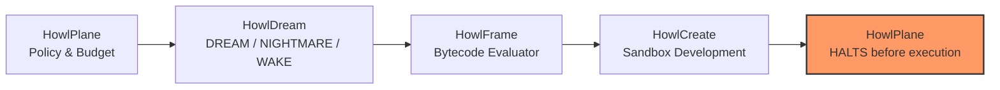

# HowlDream

Controlled divergent exploration for AI systems. Experimental, Phase 2 evaluation.

**Let AI dream. Decide what survives when it wakes.**

**Dream output is data, not authority.**

[Website](https://howlcipher.github.io/howldream/) ·
[Ecosystem](https://howlcipher.github.io/howl/ecosystem.html) ·
[CI](https://github.com/howlcipher/howldream/actions/workflows/ci.yml)

## DREAM / NIGHTMARE / WAKE

| State | What it does |
| --- | --- |
| DREAM | Generates divergent proposals beside a conventional baseline; all start UNVERIFIED |
| NIGHTMARE | Perturbs context or injects explicitly untrusted premises to stress reliability |
| WAKE | Checks supplied fact records, source IDs and arithmetic; preserves unresolved claims |

HowlDream is an experimental laboratory, not a truth oracle. HowlCreate already
performs creative search; HowlDream adds controlled conditions, failure analysis,
comparative measurements, and inspectable experiment records.

## Quick start

```bash
git clone https://github.com/howlcipher/howldream.git
cd howldream
python3 -m venv .venv
source .venv/bin/activate
pip install -e .
howldream validate examples/self_detection.yaml
howldream run examples/self_detection.yaml
howldream explore --goal "Design fault-tolerant cache" --budget-candidates 3
howldream benchmark list
howldream benchmark run dreambench --split development
howldream evaluate dreamvalue
```

No credentials or network inference are needed for the deterministic demo. Its
authored catalog is clearly labeled, not presented as AI discovery. Optional
Ollama and compatible HTTP providers support actual model experiments.

The CLI prints its artifact directory. Use that path with `inspect`, `wake`,
`replay`, `report`, and `compare`. `dream` and `nightmare` save generation for
later WAKE; `run` executes the whole pipeline. `--output` selects artifact storage.

## Measured evaluation

DreamBench 0.3.0 contains 84 independently authored natural-language cases and
186 claim annotations across four explicit splits (development, validation,
held-out, confirmation). Upstream extraction improvements lifted recall on natural
language from 0.2143 (pre-improvement baseline) to **0.8571** (precision 0.8000,
F1 0.8276) across 16 claim forms while preserving 100% regression fidelity on
DreamBench 0.2.0 (52 TP, 0 FP, 234 TN, 26 FN, F1 0.8000). Pipeline error
attribution isolates remaining failures into 3 extraction misses (threshold boundary)
and 3 normalization fallbacks, with zero verifier or classifier misses.

DreamValue blinded multi-rater evaluation evaluated 480 candidates across 24
technical domains with 3 blinded simulated reviewer personas (1,060 completed reviews, mean
Cohen's kappa 0.6154, raw agreement 74.97%). The simulated evaluator study validated an
INVESTIGATE rate of **72.08%** for DREAM candidates versus **12.08%** for baseline
checklists. An evidence integrity audit confirmed these raters were algorithmic simulated
personas rather than independent human engineers.

Fair equal-budget live model experiments against local Ollama models
(`qwen2.5-coder:1.5b-instruct` and `7b-instruct`) across 10 systems engineering
tasks (60 fair comparison generations, 96 structured task candidates, 133 total generations across sweeps)
confirmed that DREAM matches baseline conceptual cluster count (12 vs 12) while
delivering an absolute useful candidate yield advantage of **+100.2 candidates per 10k output tokens**
over zero-yield baseline checklists (multiplicative ratio undefined per the zero-denominator rule).
An empirical useful-divergence frontier remains **not yet demonstrated** due to zero observed
unsupported claims across tested temperatures (0.4–1.4). The promotion decision is
**PROMOTE WITH CONDITIONS** (requiring independent blinded human review before claiming human-validated
superiority). See the [Milestone Three report](docs/milestone_three_report.md) and
[canonical manifest](evaluation/results/milestone_three_manifest.json).

A local Ollama methodology audit challenged subtle unblinding, token budget
leakage, and evaluator bias. See [dogfood findings](docs/dogfood.md) and the
[raw evidence](dogfood/).

## Controlled Ecosystem Integration (Milestone Four)

HowlDream 0.4.0 provides controlled native integration with the Howl engineering ecosystem:



* **Zero Execution Authority**: Speculative candidates and exploratory envelopes carry `EXECUTION_AUTHORITY: NONE`. They cannot self-approve, emit execution receipts, or authorize changes.
* **Strict Segregation**: HowlChangeOps is downstream and isolated; speculative inputs and candidate IDs cannot be accepted as execution authority.
* **Native Schemas**: Strict versioned schemas for ecosystem interoperability:
  * `howl.exploration/v1`: Exploration requests specifying goals, budgets, and constraints.
  * `howl.candidate/v1`: Immutable candidate representations with source provenance.
  * `howl.assessment/v1`: Structured evaluation assessments with explicit rationale.
  * `howl.exploration_result/v1`: Completed exploration envelopes with descent DAG lineage.
  * `howl.development_result/v1`: Deliberate sandbox development specifications without execution authority.
* **Descent DAG Lineage**: Bounded directed acyclic graph tracing exploration ancestry, branching factors, and parent-child candidate relationships (`howldream trace`).
* **Adapters & Harnesses**:
  * **HowlPlane**: Native `HowlDreamRunner` orchestrates bounded exploration, invokes HowlFrame verification, promotes viable candidates to HowlCreate, and asserts zero execution authority.
  * **HowlFrame**: Native `candidate_evaluator.howl` app and compiled bytecode (`.hfbc`) for invariant verification.
  * **HowlCreate**: Native `candidate_ingestion` module develops candidates into sandbox prototype designs.
  * **HowlRelay**: Native `HowlDreamCollector` gathers exploration evidence into the relay state store.

## What exists

Strict versioned YAML/JSON experiments, bounded trials, provider capability records,
baseline/control runs, four context perturbations, claim grammar, extensible failure
taxonomy, exact arithmetic and supplied-ledger checks, modular scorer interface,
lexical diversity/novelty, duplicate grouping, reports, replay lineage, Descent DAG
ancestry tracing, native ecosystem integration schemas (`howl.exploration/v1`,
`howl.candidate/v1`, `howl.assessment/v1`, `howl.development_result/v1`), and advisory
handoffs. No generated code execution or hidden reasoning capture.

Final dogfood strengthened relevance triage: common function words no longer make
an unrelated proposal worth investigating. Historical artifacts retain the earlier
scores; new runs record the corrected implementation hash.

## Documentation

* [Architecture and alternatives](docs/architecture.md)
* [Experiment fields and CLI reference](docs/experiments.md)
* [Providers and observable telemetry](docs/providers.md)
* [Trust, security, privacy and limitations](docs/trust_privacy.md)
* [DreamBench and DreamValue methodology](docs/benchmarks.md)
* [Annotation guidelines](docs/annotation_guidelines.md)
* [Milestone Three evaluation report](docs/milestone_three_report.md)
* [Milestone Two evaluation report](docs/milestone_two_report.md)
* [Ecosystem audit and contracts](docs/ecosystem.md)
* [Roadmap](ROADMAP.md)
* [Verification evidence](docs/validation.md)

## Development

```bash
pip install -e '.[dev]'
ruff format --check src tests scripts
ruff check src tests scripts
flake8 src tests --max-line-length=100 --extend-ignore=E203,W503
mypy
pytest -q
howldream benchmark run dreambench --split development
howldream evaluate dreamvalue
python -m build
bandit -r src -ll
pip-audit --skip-editable
python -m playwright install chromium
python scripts/check_site.py
```

Artifacts can contain sensitive source material. Storage is local plaintext,
redaction is best effort, and text retention can be disabled. Real-provider
replay repeats configuration, not guaranteed output. HowlDream is not included
in the default Howl installer. MIT licensed; experimental, not production-ready.
