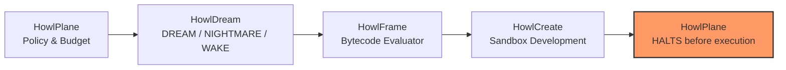

# HowlDream

Controlled divergent exploration for AI systems. Experimental, Phase 2 evaluation.

**Let AI dream. Decide what survives when it wakes.**

**Dream output is data, not authority.**

[Website](https://howlcipher.github.io/howldream/) ·
[Ecosystem](https://howlcipher.github.io/howl/ecosystem.html) ·
[CI](https://github.com/howlcipher/howldream/actions/workflows/ci.yml)

## DREAM / NIGHTMARE / WAKE

| State | What it does |
| --- | --- |
| DREAM | Generates divergent proposals beside a conventional baseline; all start UNVERIFIED |
| NIGHTMARE | Perturbs context or injects explicitly untrusted premises to stress reliability |
| WAKE | Checks supplied fact records, source IDs and arithmetic; preserves unresolved claims |

HowlDream is an experimental laboratory, not a truth oracle. HowlCreate already
performs creative search; HowlDream adds controlled conditions, failure analysis,
comparative measurements, and inspectable experiment records.

## Quick start

```bash
git clone https://github.com/howlcipher/howldream.git
cd howldream
python3 -m venv .venv
source .venv/bin/activate
pip install -e .
howldream validate examples/self_detection.yaml
howldream run examples/self_detection.yaml
howldream explore --goal "Design fault-tolerant cache" --budget-candidates 3
howldream benchmark list
howldream benchmark run dreambench --split development
howldream evaluate dreamvalue
```

No credentials or network inference are needed for the deterministic demo. Its
authored catalog is clearly labeled, not presented as AI discovery. Optional
Ollama and compatible HTTP providers support actual model experiments.

The CLI prints its artifact directory. Use that path with `inspect`, `wake`,
`replay`, `report`, and `compare`. `dream` and `nightmare` save generation for
later WAKE; `run` executes the whole pipeline. `--output` selects artifact storage.

## Measured evaluation

DreamBench 0.3.0 contains 84 independently authored natural-language cases and
186 claim annotations across four explicit splits (development, validation,
held-out, confirmation). Upstream extraction improvements lifted recall on natural
language from 0.2143 (pre-improvement baseline) to **0.8571** (precision 0.8000,
F1 0.8276) across 16 claim forms while preserving 100% regression fidelity on
DreamBench 0.2.0 (52 TP, 0 FP, 234 TN, 26 FN, F1 0.8000). Pipeline error
attribution isolates remaining failures into 3 extraction misses (threshold boundary)
and 3 normalization fallbacks, with zero verifier or classifier misses.

DreamValue blinded multi-rater evaluation evaluated 480 candidates across 24
technical domains with 3 blinded simulated reviewer personas (1,060 completed reviews, mean
Cohen's kappa 0.6154, raw agreement 74.97%). The simulated evaluator study validated an
INVESTIGATE rate of **72.08%** for DREAM candidates versus **12.08%** for baseline
checklists. An evidence integrity audit confirmed these raters were algorithmic simulated
personas rather than independent human engineers.

Fair equal-budget live model experiments against local Ollama models
(`qwen2.5-coder:1.5b-instruct` and `7b-instruct`) across 10 systems engineering
tasks (60 fair comparison generations, 96 structured task candidates, 133 total generations across sweeps)
confirmed that DREAM matches baseline conceptual cluster count (12 vs 12) while
delivering an absolute useful candidate yield advantage of **+100.2 candidates per 10k output tokens**
over zero-yield baseline checklists (multiplicative ratio undefined per the zero-denominator rule).
An empirical useful-divergence frontier remains **not yet demonstrated** due to zero observed
unsupported claims across tested temperatures (0.4–1.4). The promotion decision is
**PROMOTE WITH CONDITIONS** (requiring independent blinded human review before claiming human-validated
superiority). See the [Milestone Three report](docs/milestone_three_report.md) and
[canonical manifest](evaluation/results/milestone_three_manifest.json).

A local Ollama methodology audit challenged subtle unblinding, token budget
leakage, and evaluator bias. See [dogfood findings](docs/dogfood.md) and the
[raw evidence](dogfood/).

## Controlled Ecosystem Integration (Milestone Four)

HowlDream 0.4.3 provides controlled contracts and partial integration with the Howl
engineering ecosystem. **Corrected 2026-09-11** (see [change log](change_log.md#041)):
the 0.4.0 entry overstated this milestone as fully "native" across all four systems.
Verified status per integration, cross-checked against the sibling repositories rather
than restated from memory:

| Target | What actually runs today |
| --- | --- |
| HowlPlane | Real `HowlDreamRunner`/`NativeHowlDreamProvider`, merged in howlplane. **Update 2026-09-12**: howlplane's CI now also installs a pinned `howldream` commit and runs a real-import (`live`-marked) test against it (howlplane PR #101) — verified in a real GitHub Actions run, not just locally. `howldream` remains an optional install, never a `pyproject.toml` dependency. |
| HowlCreate | Real `candidate_ingestion.develop_candidate()` merged and unit-tested in howlcreate. As of 0.4.1, HowlDream's CI (`ecosystem-integration` job) installs a pinned `howlcreate` commit and confirms the real import before running `tests/test_end_to_end_ecosystem.py`, so the real module is now genuinely exercised, not just the local `except ImportError` fallback. |
| HowlFrame | **Update 2026-09-12**: `candidate_evaluator.howl` and its Go integration test merged to howlframe `main` on 2026-09-11 (PR #40) — this session found that report stale and re-verified directly: `go test ./apps/candidate_evaluator/...` passes fresh from howlframe `main` (5/5 subtests, including both authority-escalation rejections). HowlDream's own in-process Python reimplementation remains as a fallback path, not the sole implementation. |
| HowlRelay | Real, tested, and self-contained: `HowlDreamCollector` reads exploration envelopes off disk with no package dependency on HowlDream. This one is accurately described below. |

**Update 2026-09-12** (see `issues.md` items 1–3, now closed): generated,
drift-checked JSON Schema for all five `howl.*` envelopes exists in `schemas/` (see
`schemas/README.md` for the generation/versioning/vendoring policy, and
`AUTHORITY_INVARIANT.md` for exactly which authority claims schema validation
enforces on its own vs. which require a runtime control). howlframe vendored these
schemas and added a pure-Go contract test validating a real envelope and rejecting
forged ones — no Python, no `howldream` import (howlframe PR #41). Item 4 (portable
dogfood reproduction) remains open and is now unblocked by HowlFrame's merge, but is
not itself done — see that item.



* **Zero Execution Authority**: Speculative candidates and exploratory envelopes carry `EXECUTION_AUTHORITY: NONE`. They cannot self-approve, emit execution receipts, or authorize changes.
* **Strict Segregation**: HowlChangeOps is downstream and isolated; speculative inputs and candidate IDs cannot be accepted as execution authority.
* **Native Schemas**: Strict versioned schemas for ecosystem interoperability:
  * `howl.exploration/v1`: Exploration requests specifying goals, budgets, and constraints.
  * `howl.candidate/v1`: Immutable candidate representations with source provenance.
  * `howl.assessment/v1`: Structured evaluation assessments with explicit rationale.
  * `howl.exploration_result/v1`: Completed exploration envelopes with descent DAG lineage.
  * `howl.development_result/v1`: Deliberate sandbox development specifications without execution authority.
* **Descent DAG Lineage**: Bounded directed acyclic graph tracing exploration ancestry, branching factors, and parent-child candidate relationships (`howldream trace`).
* **Adapters & Harnesses** (see status table above for what each side's CI actually exercises):
  * **HowlPlane**: `HowlDreamRunner` orchestrates bounded exploration, invokes HowlFrame verification, promotes viable candidates to HowlCreate, and asserts zero execution authority. Merged in howlplane; as of 2026-09-12, howlplane's own CI also exercises the real cross-repo import via a pinned, `live`-marked test.
  * **HowlFrame**: `candidate_evaluator.howl` app and compiled bytecode (`.hfbc`) for invariant verification merged to howlframe `main` 2026-09-11 (PR #40), independently re-verified 2026-09-12. HowlDream's in-process Python evaluator remains available as a fallback when the compiled evaluator isn't provisioned.
  * **HowlCreate**: `candidate_ingestion` module develops candidates into sandbox prototype designs. Merged in howlcreate; as of 0.4.1, HowlDream's CI installs a pinned `howlcreate` commit and exercises this real module rather than the local fallback stub.
  * **HowlRelay**: Native `HowlDreamCollector` gathers exploration evidence into the relay state store. Merged, tested, and self-contained (no package dependency on HowlDream).

## What exists

Strict versioned YAML/JSON experiments, bounded trials, provider capability records,
baseline/control runs, four context perturbations, claim grammar, extensible failure
taxonomy, exact arithmetic and supplied-ledger checks, modular scorer interface,
lexical diversity/novelty, duplicate grouping, reports, replay lineage, Descent DAG
ancestry tracing, native ecosystem integration schemas (`howl.exploration/v1`,
`howl.candidate/v1`, `howl.assessment/v1`, `howl.development_result/v1`), and advisory
handoffs. No generated code execution or hidden reasoning capture.

Final dogfood strengthened relevance triage: common function words no longer make
an unrelated proposal worth investigating. Historical artifacts retain the earlier
scores; new runs record the corrected implementation hash.

## Documentation

* [Architecture and alternatives](docs/architecture.md)
* [Experiment fields and CLI reference](docs/experiments.md)
* [Providers and observable telemetry](docs/providers.md)
* [Trust, security, privacy and limitations](docs/trust_privacy.md)
* [DreamBench and DreamValue methodology](docs/benchmarks.md)
* [Annotation guidelines](docs/annotation_guidelines.md)
* [Milestone Three evaluation report](docs/milestone_three_report.md)
* [Milestone Two evaluation report](docs/milestone_two_report.md)
* [Ecosystem audit and contracts](docs/ecosystem.md)
* [Roadmap](ROADMAP.md)
* [Verification evidence](docs/validation.md)
* [Open backlog](issues.md)

## Development

```bash
pip install -e '.[dev]'
ruff format --check src tests scripts
ruff check src tests scripts
flake8 src tests --max-line-length=100 --extend-ignore=E203,W503
mypy
pytest -q
howldream benchmark run dreambench --split development
howldream evaluate dreamvalue
python -m build
bandit -r src -ll
pip-audit --skip-editable
python -m playwright install chromium
python scripts/check_site.py
```

Artifacts can contain sensitive source material. Storage is local plaintext,
redaction is best effort, and text retention can be disabled. Real-provider
replay repeats configuration, not guaranteed output. HowlDream is not included
in the default Howl installer. MIT licensed; experimental, not production-ready.

## Evidence-driven repair (0.4.4)

Local inference requires explicit opt-in and respects `HOWL_FORBID_LOCAL_INFERENCE=1`.
Remote command adapters use explicitly reviewed operator profiles. Exploration accepts
explicit providers and unverified source candidates; exports/reviews preserve identity
and scoped checks. Unsupported generated facts no longer become verified constraints.
See [provider policy and typed handoffs](docs/providers.md). Historical reports above
retain their original dates and do not establish current end-to-end Plane compatibility.

Verification CI sets `HOWL_FORBID_LOCAL_INFERENCE=1`. The shared provider dependency
is pinned to its final reviewed commit, including portable command-provider tests.

## Candidate exploration, validation, and measurement integrity

```bash
export HOWL_FORBID_LOCAL_INFERENCE=1
howldream validate candidate.json
howldream explore --from-candidate candidate.json \
  --objective "Attack assumptions and identify falsifiable risks" \
  --evidence evidence.json --output .howldream/runs
howldream review candidate.json --evidence evidence.json
```

The bridge preserves one canonical advisory source candidate, including Create
claims, evidence needs, constraints, uncertainty, provenance and identity. It does
not convert speculation into evidence. Generated candidates carry source IDs,
source run IDs and hashes, pointing to
`exploration_envelope.json#/provenance/source_candidates`. Default bridge budget is
three calls (one baseline, two divergent candidates), using authored mock output.
For an authorized remote CLI add `--command-config /absolute/path/profile.json
--allow-remote`; the reviewed profile is never discovered from candidate data.
`--max-calls` remains a hard ceiling. A partial exploration exits nonzero.

`validate` routes explicit canonical schema versions: experiment (integer 1),
exploration request/result, candidate (including reviewed candidates), assessment,
development result, and a nonempty strict evidence list. Unknown/ambiguous input
fails with UNKNOWN_ARTIFACT_TYPE. Validation does not invoke a provider.

Each generated row contains `sampling.temperature`, `sampling.seed`, and
`sampling.top_p`, separating requested values, supported transport controls, and
application. Raw/structured commands and mock fixtures apply neither temperature
nor seed. HTTP temperature is transmitted; Ollama seed is supported by its adapter
but local inference remains forbidden by default and the environment override is
authoritative. `applied` does not independently authenticate remote backend behavior.
Unsupported controls produce EXPERIMENT_CONTROL_NOT_APPLIED in manifest warnings.
Do not interpret baseline-vs-Dream differences as a temperature experiment when
that control was not applied. Top-p is not requested by this workflow.

WAKE verifier v2 classifies direct fact-ledger matches and conservative lexical
restatements of source text as ECHO. They receive no independent SUPPORTED credit.
Metrics version 2 separates supported_count, echo_count, contradicted_count,
uncertain_count and false_premise_rejection_count. Uncertain includes unsupported
claims whose falsity is unknown. Arithmetic/explicit conflict checks retain their
narrow support scope; free-form semantic derivation remains uncertain. Echo detection
preserves polarity and numbers but is a lexical heuristic; semantic paraphrases may
need human review. Historical v1 metrics are not directly comparable.

Command errors carry sanitized structured categories and execution telemetry,
including failures after inference. Adapters are `raw-text`, `generic-json`,
`claude-json`, `openai-json`, and `gemini-json` (see provider-core's input shapes).
No retries occur in Dream. Session/authentication/cancellation failures stop further
requests; remote timeout stays profile-specific rather than globally increased.
The default exploration allowlist is now mock only. A profile can explicitly choose
up to 600 seconds per call; an exploration's duration field currently sets HTTP
per-call timeout, not a total wall-clock deadline.

`howldream audit-attribution ledger.json` mechanically flags chronology conflicts;
see [the attribution guide](docs/dogfood_attribution_guide.md). It reports evidence
and does not rewrite reports or grant authority.

Ecosystem CI pins the Create repair that retains existing finalists on failed resume.
Provider-core is pinned to preserve telemetry for invalid nested CLI completion shapes as well.
