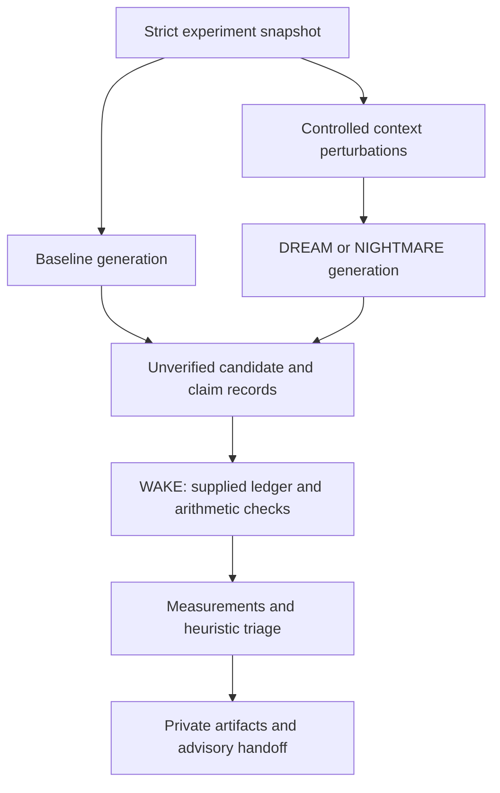

# Architecture

Status: extended for experimental milestone four.

HowlDream owns controlled divergent experiments, fault injection, comparative measurements,
and inspectable evidence. HowlCreate already performs divergent/convergent creative search;
HowlDream does not claim to invent that capability. Its distinguishing unit is a controlled
experiment with a baseline, observable outputs, and scoped verification.

## Decision and alternatives

Python 3.11+ follows HowlCreate, HowlRelay, and HowlWriter. Pydantic provides strict
bounded schemas; PyYAML provides safe YAML parsing. The standard HTTP library avoids a
mandatory provider SDK. Advantages: small modular CLI, rapid experiment iteration, portable
wheels. Costs: an interpreter and two runtime dependencies, sequential generation.

Go would offer a single binary and matches the installer and HowlFrame, but is less convenient
for experimentation tooling. HowlFrame would demonstrate ecosystem dogfooding, but introduces
a compiler/runtime dependency without improving this milestone's evidence analysis. Neither
is necessary for the current core. Static HTML/CSS fits existing Pages conventions and needs
no client framework, build service, or tracking. Its cost is manually maintained content.

## Modules and flow



`schema.py` owns input contracts; `contracts.py` owns ecosystem interoperability schemas
and the `DescentDAG`; `providers.py` owns observable generation; `engine.py` owns bounded
experiment order, snapshot replay, and the `explore()` workflow; `verification.py` owns
the claim grammar, taxonomy registry, and deterministic checks; `scoring.py` owns
lexical comparison and triage; `artifacts.py` owns run persistence and envelope loading;
`benchmark.py` owns split-aware reliability evaluation; `dreamvalue.py` owns conceptual-yield
metrics and review packets; `cli.py` owns user interaction.

Benchmark definitions are versioned package data. Run artifacts are canonical;
`scripts/build_site_evaluation.py` derives Pages data from them. Deterministic
authored approach identifiers provide reproducible clusters. Embeddings could
improve paraphrase grouping but add model drift and opaque thresholds, so they
remain deferred and must be labeled heuristic if added.

There is no model-driven execution, tool dispatch, dynamic code loading, `eval`, shell
command interpreter, or external verifier in the experiment engine. Arithmetic uses
bounded rational operands and a fixed operator table. Remote provider configuration
is explicit. Baseline and experimental candidates use the same provider and original
evidence; only experimental prompts receive perturbations. WAKE always uses original evidence.

## Evidence semantics

Observed prompts, supplied sources, generated speculation, extracted claims, verifier
results, heuristic judgments, and deterministic measurements have separate records.
Candidates and extracted claims retain `UNVERIFIED` even when a linked check succeeds.
`SUPPORTED` means only the named check succeeded in its declared scope. No overall
`SURVIVES_VERIFICATION` or accepted-truth state is emitted in milestone one.

Exact/near duplicate grouping uses token Jaccard distance at threshold 0.15; this is
lexical grouping, not semantic clustering. Novelty uses distance from the closest
baseline text and is explicitly heuristic. Relevance uses objective token overlap.
Failure, duplication, or missing relevance causes REJECT. Other proposals may receive
INVESTIGATE, retaining all unresolved assumptions. There is no numerical feasibility
or creativity claim. Majority model agreement is never a verification rule.

## Persistence and limits

Each run has a timestamp plus random ID, source/prompt/output SHA-256 hashes, a versioned
manifest, JSON snapshot, JSONL candidates/claims/checks, metrics, scores, report, and handoff.
Hashes detect accidental changes against a retained manifest, not malicious replacement
of both files and manifest. WAKE and replay create descendants; they do not overwrite a run.
One experiment has at most 500 requests; each has a timeout and output limit. No automatic
retries or background services. A provider failure is recorded and yields PARTIAL with
nonzero CLI exit status. Interrupted processes may leave an incomplete directory.

## Controlled Native Ecosystem Architecture

In Milestone Four, HowlDream connects natively into the Howl engineering loop while maintaining
an immutable zero execution authority boundary:

```mermaid
flowchart TD
  subgraph Orchestration ["HowlPlane (Policy & Circuit Breakers)"]
    HP_IN[Exploration Request] --> HP_BUDGET[Budget & Circuit Breaker Guard]
  end

  subgraph Exploration ["HowlDream (Divergent Engine)"]
    HP_BUDGET --> HD_EXP[explore() Engine]
    HD_EXP --> HD_DAG[Descent DAG Lineage]
    HD_EXP --> HD_ENV[Exploration Envelope]
  end

  subgraph Verification ["HowlFrame (Bytecode Evaluator)"]
    HD_ENV --> HF_APP[candidate_evaluator.hfbc]
    HF_APP --> HF_ASSESS[howl.assessment/v1]
  end

  subgraph Prototyping ["HowlCreate (Sandbox Development)"]
    HF_ASSESS -->|PURSUE candidates| HC_INGEST[develop_candidate()]
    HC_INGEST --> HC_RES[howl.development_result/v1\nEXECUTION_AUTHORITY: NONE]
  end

  subgraph Terminal ["HowlPlane Final Halting"]
    HC_RES --> HP_HALT[HALT / Human Review Required]
  end

  subgraph Isolated ["Isolated Downstream"]
    H_OPS[HowlChangeOps]
    HP_HALT -.->|HARD BOUNDARY\nNo Speculative Execution| H_OPS
  end

  style Isolated stroke:#f00,stroke-dasharray: 5 5
  style H_OPS fill:#ffebee,stroke:#c62828
  style HP_HALT fill:#fff3e0,stroke:#ef6c00
```

### Verified status (corrected 2026-09-11, updated 2026-09-12)

The diagram above shows the designed loop. Cross-checked directly against the sibling
repositories, most recently on 2026-09-12 (do not trust this snapshot indefinitely —
re-verify against live repo state before relying on it):

* `HD_ENV --> HF_APP[candidate_evaluator.hfbc]`: **real, merged to `main`.** This
  report previously said `apps/candidate_evaluator/candidate_evaluator.howl` existed
  only on an unmerged howlframe branch; that had already changed by the time it was
  re-checked (howlframe PR #40, merged 2026-09-11) and was independently re-verified
  rather than trusted (`go test ./apps/candidate_evaluator/...` on a fresh
  `main`, 5/5 pass). Neither HowlDream's nor HowlPlane's pipeline builds/invokes the
  compiled `.hfbc` automatically yet, though — both use it only when
  `HOWLFRAME_HFBC_PATH`/`HOWLFRAME_CANDIDATE_EVALUATOR_BC` points at one, falling back
  to an in-process Python reimplementation of the same rules otherwise. `issues.md`
  item 3 (the merge) is closed; item 4 (a portable, reproducible run through the real
  bytecode, not a manual env var) is still open.
* `HF_ASSESS --> HC_INGEST[develop_candidate()]`: the HowlCreate side is real and
  merged (`howlcreate/src/howlcreate/engine/candidate_ingestion.py`, unit-tested
  there). As of 0.4.1, HowlDream's CI (`ecosystem-integration` job) installs a
  pinned `howlcreate` commit and exercises the real import rather than the
  same-file `except ImportError` fallback.
* `HP_BUDGET`/orchestration: `HowlDreamRunner` is real and merged in howlplane.
  `howldream` is still not a declared dependency there (by design — see
  `schemas/README.md`), but as of 2026-09-12 howlplane's own CI installs it pinned to
  a specific commit and runs a real-import (`live`-marked) test against it, verified
  in an actual GitHub Actions run (`issues.md` item 2, closed).
* HowlRelay's collector (not shown in this diagram) remains merged and genuinely
  exercised end-to-end without qualification.

See `docs/ecosystem.md` and `change_log.md` (0.4.1, 0.4.2) for the full correction
history.

**2026-09-12**: `howl.exploration/v1`, `howl.candidate/v1`, `howl.assessment/v1`,
`howl.exploration_result/v1`, and `howl.development_result/v1` (every envelope named in
this diagram) now have generated, drift-checked JSON Schema in `schemas/` — see
`schemas/README.md` and `AUTHORITY_INVARIANT.md`. howlframe vendored these schemas and
added a pure-Go test validating a real envelope and rejecting forged ones, without
importing `howldream` (`issues.md` item 1, closed). The only remaining open item is 4
(portable dogfood reproduction).

### Invariants and Boundaries

1. **Zero Execution Authority**:
   - `howl.exploration_result/v1` and `howl.development_result/v1` explicitly specify `EXECUTION_AUTHORITY: NONE`.
   - HowlDream does not execute code, alter repositories, or issue change approvals.
2. **Strict Downstream Segregation**:
   - `HowlChangeOps` is strictly downstream from deliberate engineering; it rejects any attempt to register execution receipts from `howldream` or `howlcreate`.
   - The loop terminates at HowlPlane with advisory status and requires out-of-band human review before any change operation can be created.
3. **Descent DAG Lineage**:
   - The `DescentDAG` structure enforces cycle detection, bounded branching factor, and depth limits.
   - All speculative candidates retain lineage pointers (`parent_candidate_id`), enabling auditability of exploratory branches.
