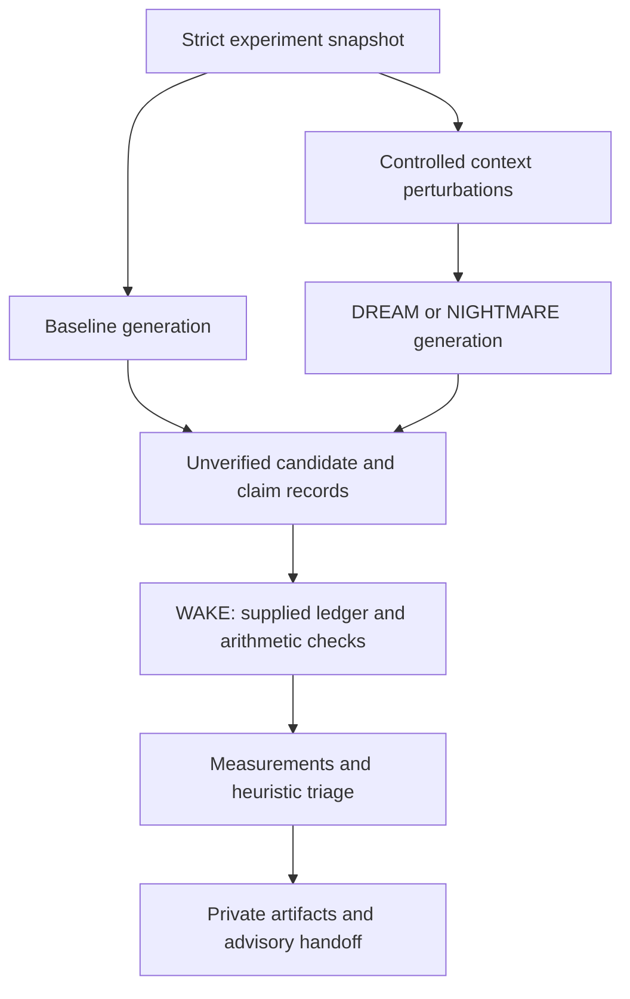

# Architecture

Status: accepted for experimental milestone one.

HowlDream owns controlled divergent experiments, fault injection, comparative measurements,
and inspectable evidence. HowlCreate already performs divergent/convergent creative search;
HowlDream does not claim to invent that capability. Its distinguishing unit is a controlled
experiment with a baseline, observable outputs, and scoped verification.

## Decision and alternatives

Python 3.11+ follows HowlCreate, HowlRelay, and HowlWriter. Pydantic provides strict
bounded schemas; PyYAML provides safe YAML parsing. The standard HTTP library avoids a
mandatory provider SDK. Advantages: small modular CLI, rapid experiment iteration, portable
wheels. Costs: an interpreter and two runtime dependencies, sequential generation.

Go would offer a single binary and matches the installer and HowlFrame, but is less convenient
for experimentation tooling. HowlFrame would demonstrate ecosystem dogfooding, but introduces
a compiler/runtime dependency without improving this milestone's evidence analysis. Neither
is necessary for the current core. Static HTML/CSS fits existing Pages conventions and needs
no client framework, build service, or tracking. Its cost is manually maintained content.

## Modules and flow

`schema.py` owns input contracts; `providers.py` owns observable generation;
`engine.py` owns bounded experiment order and snapshot replay; `verification.py` owns
the claim grammar, taxonomy registry, and deterministic checks; `scoring.py` owns
the scorer protocol, lexical comparison, and triage; `artifacts.py` owns redaction
and persistence; `benchmark.py` owns fixture evaluation; `cli.py` owns user interaction.

There is no model-driven execution, tool dispatch, dynamic code loading, `eval`, shell
command interpreter, or external verifier in the experiment engine. Arithmetic uses
bounded rational operands and a fixed operator table. Remote provider configuration
is explicit. Baseline and experimental candidates use the same provider and original
evidence; only experimental prompts receive perturbations. WAKE always uses original evidence.

## Evidence semantics

Observed prompts, supplied sources, generated speculation, extracted claims, verifier
results, heuristic judgments, and deterministic measurements have separate records.
Candidates and extracted claims retain `UNVERIFIED` even when a linked check succeeds.
`SUPPORTED` means only the named check succeeded in its declared scope. No overall
`SURVIVES_VERIFICATION` or accepted-truth state is emitted in milestone one.

Exact/near duplicate grouping uses token Jaccard distance at threshold 0.15; this is
lexical grouping, not semantic clustering. Novelty uses distance from the closest
baseline text and is explicitly heuristic. Relevance uses objective token overlap.
Failure, duplication, or missing relevance causes REJECT. Other proposals may receive
INVESTIGATE, retaining all unresolved assumptions. There is no numerical feasibility
or creativity claim. Majority model agreement is never a verification rule.

## Persistence and limits

Each run has a timestamp plus random ID, source/prompt/output SHA-256 hashes, a versioned
manifest, JSON snapshot, JSONL candidates/claims/checks, metrics, scores, report, and handoff.
Hashes detect accidental changes against a retained manifest, not malicious replacement
of both files and manifest. WAKE and replay create descendants; they do not overwrite a run.
One experiment has at most 500 requests; each has a timeout and output limit. No automatic
retries or background services. A provider failure is recorded and yields PARTIAL with
nonzero CLI exit status. Interrupted processes may leave an incomplete directory.
