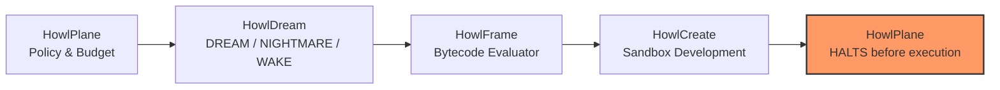

# Ecosystem audit and handoff contracts

Inspected 2026-09-08: local READMEs, HowlPlane CONTROL_PLANE and data-flow documents,
HowlWriter claim records, HowlCreate providers, installer manifest, Pages API metadata,
CI configurations, repository branches/status, and current GitHub metadata.

## Actual boundaries

| Component | Current role | Relationship to HowlDream |
| --- | --- | --- |
| HowlPlane | Operational AI engineering orchestration and authority gates | `HowlDreamRunner` merged in howlplane (policy, budget, HowlFrame dispatch, HowlCreate handoff; HALTS before execution). As of 2026-09-12, howlplane's own CI also installs a pinned `howldream` commit and runs a real-import `live` test against it (verified in a real Actions run, not just locally) |
| HowlCreate | Experimental creative search, mutation, challenge, concept lineage | `candidate_ingestion.py` merged and unit-tested in howlcreate. As of 0.4.1, HowlDream's CI installs a pinned `howlcreate` commit and its end-to-end test exercises the real module instead of the same-file fallback stub |
| HowlFrame | Experimental language, compiler, capability-bounded VM | `candidate_evaluator.howl` / `.hfbc` merged to howlframe `main` 2026-09-11 (PR #40); independently re-verified 2026-09-12 (`go test ./apps/candidate_evaluator/...`, 5/5 pass fresh from `main`). HowlDream's in-process Python reimplementation remains as a fallback |
| HowlChangeOps | Governed change execution, HowlFrame policy, human approvals | Sole relevant release boundary; hard negative boundary rejects speculative candidate execution |
| HowlRelay | Experimental async work-state and handoff system | Native adapter (`HowlDreamCollector`): collects `HOWLDREAM_EXPLORATION` evidence into relay store |
| HowlWriter | Writing, citation/provenance and verification workflows | May communicate reviewed conclusions; claims begin unverified, as in its domain model |
| Howl | Installer/lifecycle manager and canonical Pages hub | Dream is not registered in its default manifest |

HowlCreate already includes divergent exploration. The intended shorthand is:
HowlCreate invents intentionally; HowlDream explores speculatively through measured
experimental conditions. Neither output creates authority. HowlFrame's live README
and runtime contradict the broader "evidence/reasoning service" shorthand in HowlCreate's
README. This audit uses the actual language/runtime role; sibling copy is a future
documentation-sync candidate.

HowlBoard and HowlNotes are active external HowlFrame reference applications.
HowlBot is an external Discord policy dogfood application, not a core orchestration
component. `changeops` is a compatibility name and duplicate local checkout of
`howlchangeops`, not a separate current project. `ai_knowledge_library` is now the
HowlPlane knowledge subsystem. No inspected current component is declared deprecated
merely because of age. Repository existence alone is not a maturity guarantee.

## Native Ecosystem Integration (Milestone Four)

**Corrected 2026-09-11, updated 2026-09-12**: Milestone Four delivers native
*contracts* for a bounded ecosystem exploration loop, and real, merged harness code
on all four sides. As of 2026-09-12: HowlDream's own CI genuinely exercises the real
HowlCreate import; HowlPlane's own CI now also genuinely exercises the real HowlDream
import via a pinned, `live`-marked test (`issues.md` item 2, closed); and HowlFrame's
evaluator, found merged to `main` mid-session and independently re-verified rather
than trusted from a stale report, is real (`issues.md` item 3, closed). HowlRelay
remains merged and exercised end-to-end without qualification. All five `howl.*`
envelope families now also have generated, drift-checked JSON Schema (`issues.md`
item 1, closed), with a real cross-language (Go) consumer in howlframe. The diagram
below shows the designed loop; every arrow in it now has at least one side's CI
genuinely exercising it, though not necessarily as a single unbroken run across all
four repos in one CI job — that end-to-end reproduction is `issues.md` item 4,
still open:

### Native Schemas (`src/howldream/contracts.py`, generated to `schemas/`)

**Corrected 2026-09-12**: the field lists previously here (`goal`, `budget_candidates`,
`seed_proposals`, `evaluator_policy`, `parent_candidate_id`, `state`, `run_dir`,
`prototype_design`, `test_spec`, ...) did not match the actual Pydantic field names in
`src/howldream/contracts.py` (the real fields are e.g. `objective`, `budget.max_candidates`,
`trust`, `sandbox_prototype_design`, `test_specification`). Hand-maintained field
descriptions drift from the implementation; they are replaced below with a pointer to
the generated, drift-checked source of truth instead of a second hand-written copy.

Each of the five `howl.*` envelope families below now has a generated JSON Schema file
in `schemas/` (see `schemas/README.md` for the generation command, versioning policy,
and vendoring architecture, and `AUTHORITY_INVARIANT.md` for which authority claims
schema validation enforces on its own):

1. **`howl.exploration/v1`** (`ExplorationRequest`) — `schemas/howl.exploration.v1.schema.json`
2. **`howl.candidate/v1`** (`CandidateHandoff`) — `schemas/howl.candidate.v1.schema.json`
3. **`howl.assessment/v1`** (`CandidateAssessment`) — `schemas/howl.assessment.v1.schema.json`
4. **`howl.exploration_result/v1`** (`ExplorationResult`) — `schemas/howl.exploration_result.v1.schema.json`
5. **`howl.development_result/v1`** (`DevelopmentResult`) — `schemas/howl.development_result.v1.schema.json`

For the exact, current field names and types, read the schema file or
`src/howldream/contracts.py` directly — not a description here, which would only
drift again.

### Descent DAG Lineage

The exploration lineage is recorded in a bounded Directed Acyclic Graph (`DescentDAG`):
* Nodes record candidate IDs, parent links, prompt mutation lineage, and verification state.
* Enforces bounded branching factors, maximum depth constraints, and cycle prevention.
* Provides full ancestor/descendant ancestry resolution and trace inspection via `howldream trace <run_id>`.

### Bounded Loop and Authority Boundary

The native exploration loop is strictly bounded:
1. **HowlPlane** dispatches exploration requests within strict token/candidate budgets and circuit breakers.
2. **HowlDream** explores divergent options (DREAM/NIGHTMARE/WAKE) and outputs an exploration envelope.
3. **HowlFrame** runs compiled bytecode (`candidate_evaluator.hfbc`) to verify structural invariants and claim bounds — the `.howl` source and its Go test are merged to howlframe `main` (verified 2026-09-12; see `issues.md` item 3), but neither HowlDream nor HowlPlane build/exercise the compiled `.hfbc` automatically today: both still use it only when a build is provided out-of-band (e.g. `HOWLFRAME_HFBC_PATH`/`HOWLFRAME_CANDIDATE_EVALUATOR_BC`), falling back to an in-process Python evaluator implementing the same rules otherwise. Making that a portable, reproducible step (not a manual env var pointing at a locally-built artifact) is `issues.md` item 4, still open.
4. **HowlCreate** ingests evaluated candidates with outcome `PURSUE` and synthesizes sandbox prototype specifications.
5. **HowlPlane** receives the development result and **HALTS**.

**Hard Boundary**: `HowlChangeOps` is strictly downstream, cannot be invoked by HowlDream or HowlCreate, and asserts a hard rejection rule against speculative candidate execution receipts.

## Handoff v1 (Legacy File Contract)

Every completed WAKE analysis emits `handoff.json` with `schema: howldream.handoff/v1`, run_id,
`authority: NONE`, advisory outcome, unknown confidence, and candidate scores.
Consumers join candidate IDs to `candidates.jsonl`, `claims.jsonl`, and
`verification.jsonl`; sources live in `experiment.json`. This is a documented file
contract, not a claim of native sibling API compatibility.

Generation-only DREAM/NIGHTMARE handoffs contain schema, authority NONE, and
outcome UNVERIFIED; they do not yet contain candidate analysis or confidence.

## Installer decision

NOT YET INCLUDED IN DEFAULT INSTALLER. The embedded Howl manifest defines tested,
checksummed release combinations for core components. Adding a new experimental
component before a compatible release and install lifecycle test would overstate
support. Standalone wheel/source installation is available. No installer runtime
or profile behavior changes in this milestone.
