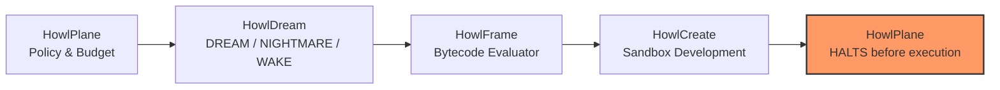

# Ecosystem audit and handoff contracts

Inspected 2026-09-08: local READMEs, HowlPlane CONTROL_PLANE and data-flow documents,
HowlWriter claim records, HowlCreate providers, installer manifest, Pages API metadata,
CI configurations, repository branches/status, and current GitHub metadata.

## Actual boundaries

| Component | Current role | Relationship to HowlDream |
| --- | --- | --- |
| HowlPlane | Operational AI engineering orchestration and authority gates | `HowlDreamRunner` merged in howlplane (policy, budget, HowlFrame dispatch, HowlCreate handoff; HALTS before execution), but `howldream` is not installable in howlplane's CI — its tests use a deterministic fake exploration provider, not a real import |
| HowlCreate | Experimental creative search, mutation, challenge, concept lineage | `candidate_ingestion.py` merged and unit-tested in howlcreate. As of 0.4.1, HowlDream's CI installs a pinned `howlcreate` commit and its end-to-end test exercises the real module instead of the same-file fallback stub |
| HowlFrame | Experimental language, compiler, capability-bounded VM | `candidate_evaluator.howl` / `.hfbc` exists only on an **unmerged** howlframe branch (`feat/milestone-four-candidate-evaluator`); not present on any `main` branch. HowlDream substitutes an in-process Python reimplementation |
| HowlChangeOps | Governed change execution, HowlFrame policy, human approvals | Sole relevant release boundary; hard negative boundary rejects speculative candidate execution |
| HowlRelay | Experimental async work-state and handoff system | Native adapter (`HowlDreamCollector`): collects `HOWLDREAM_EXPLORATION` evidence into relay store |
| HowlWriter | Writing, citation/provenance and verification workflows | May communicate reviewed conclusions; claims begin unverified, as in its domain model |
| Howl | Installer/lifecycle manager and canonical Pages hub | Dream is not registered in its default manifest |

HowlCreate already includes divergent exploration. The intended shorthand is:
HowlCreate invents intentionally; HowlDream explores speculatively through measured
experimental conditions. Neither output creates authority. HowlFrame's live README
and runtime contradict the broader "evidence/reasoning service" shorthand in HowlCreate's
README. This audit uses the actual language/runtime role; sibling copy is a future
documentation-sync candidate.

HowlBoard and HowlNotes are active external HowlFrame reference applications.
HowlBot is an external Discord policy dogfood application, not a core orchestration
component. `changeops` is a compatibility name and duplicate local checkout of
`howlchangeops`, not a separate current project. `ai_knowledge_library` is now the
HowlPlane knowledge subsystem. No inspected current component is declared deprecated
merely because of age. Repository existence alone is not a maturity guarantee.

## Native Ecosystem Integration (Milestone Four)

**Corrected 2026-09-11**: Milestone Four delivers native *contracts* for a bounded
ecosystem exploration loop, and real, merged harness code on the HowlPlane, HowlCreate,
and HowlRelay side. It does not yet deliver a genuinely cross-repo-exercised loop on
every leg — see the table above for exactly what each side's CI actually runs today.
As of 0.4.1, HowlDream's own CI genuinely exercises the real HowlCreate import; the
HowlPlane side remains merged-but-untested-via-real-import in HowlPlane's own CI
(tracked in `issues.md`, owned by that repo), and HowlFrame's evaluator is not yet
merged at all. HowlRelay is merged and exercised end-to-end without qualification.
The diagram below shows the designed loop, not a claim that every arrow in it
currently executes across real process/package boundaries in CI:

### Native Schemas (`src/howldream/contracts.py`)

1. **`howl.exploration/v1`**:
   - Structured exploration request: `goal`, `context`, `constraints`, `budget_candidates`, `budget_tokens`, `seed_proposals`, and `evaluator_policy`.
2. **`howl.candidate/v1`**:
   - First-class candidate representation: `candidate_id`, `run_id`, `content`, `parent_candidate_id`, `state` (`UNVERIFIED`), `claims`, and `source_provenance`.
3. **`howl.assessment/v1`**:
   - Multi-dimensional evaluator assessment: `candidate_id`, `run_id`, `evaluator_id`, `outcome` (`PURSUE`, `DEFER`, `REJECT`), `confidence`, `evidence_ids`, and explicit `rationale`.
4. **`howl.exploration_result/v1`**:
   - Full exploration envelope: `exploration_id`, `run_id`, `run_dir`, `candidates`, `assessments`, `descent_dag`, `metrics`, and `EXECUTION_AUTHORITY: NONE`.
5. **`howl.development_result/v1`**:
   - Deliberate sandbox development result generated by HowlCreate: `candidate_id`, `prototype_design`, `architecture_proposal`, `test_spec`, and explicit `execution_authority: "NONE"`.

### Descent DAG Lineage

The exploration lineage is recorded in a bounded Directed Acyclic Graph (`DescentDAG`):
* Nodes record candidate IDs, parent links, prompt mutation lineage, and verification state.
* Enforces bounded branching factors, maximum depth constraints, and cycle prevention.
* Provides full ancestor/descendant ancestry resolution and trace inspection via `howldream trace <run_id>`.

### Bounded Loop and Authority Boundary

The native exploration loop is strictly bounded:
1. **HowlPlane** dispatches exploration requests within strict token/candidate budgets and circuit breakers.
2. **HowlDream** explores divergent options (DREAM/NIGHTMARE/WAKE) and outputs an exploration envelope.
3. **HowlFrame** runs compiled bytecode (`candidate_evaluator.hfbc`) to verify structural invariants and claim bounds — this artifact exists only on an unmerged howlframe branch today; HowlDream substitutes an in-process Python evaluator implementing the same rules until it merges.
4. **HowlCreate** ingests evaluated candidates with outcome `PURSUE` and synthesizes sandbox prototype specifications.
5. **HowlPlane** receives the development result and **HALTS**.

**Hard Boundary**: `HowlChangeOps` is strictly downstream, cannot be invoked by HowlDream or HowlCreate, and asserts a hard rejection rule against speculative candidate execution receipts.

## Handoff v1 (Legacy File Contract)

Every completed WAKE analysis emits `handoff.json` with `schema: howldream.handoff/v1`, run_id,
`authority: NONE`, advisory outcome, unknown confidence, and candidate scores.
Consumers join candidate IDs to `candidates.jsonl`, `claims.jsonl`, and
`verification.jsonl`; sources live in `experiment.json`. This is a documented file
contract, not a claim of native sibling API compatibility.

Generation-only DREAM/NIGHTMARE handoffs contain schema, authority NONE, and
outcome UNVERIFIED; they do not yet contain candidate analysis or confidence.

## Installer decision

NOT YET INCLUDED IN DEFAULT INSTALLER. The embedded Howl manifest defines tested,
checksummed release combinations for core components. Adding a new experimental
component before a compatible release and install lifecycle test would overstate
support. Standalone wheel/source installation is available. No installer runtime
or profile behavior changes in this milestone.
