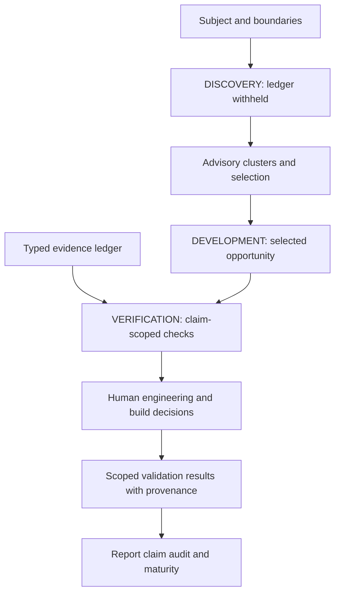

# Architecture decision

Extend existing Python/Pydantic contracts and deterministic analysis. Advantages:
no model dependency, bounded inexpensive checks, reproducible metrics, offline CI.
Limitations: lexical/concept-normalized clustering cannot prove semantic equivalence;
source declarations are not independently authenticated; report language audit is heuristic.
Embedding/model-based clustering might recognize more paraphrases but adds inference,
cost, provider drift and an opaque similarity boundary. Defer until controlled benchmark.
Provider-core owns inference policy/transport, not domain evidence semantics; no repair there.

Experiment purpose is independent from dream/nightmare condition. Legacy experiments
default DEVELOPMENT for benchmark compatibility. Exploration defaults DISCOVERY.
Verification ledger remains in the snapshot and WAKE, withheld from DISCOVERY prompts.
Context references with no explicit resolver are rejected; arbitrary risk gates are rejected.
Constraints enter prompts and handoff provenance, with explicit unverified enforcement scope.
Claim-level defects remain inspectable. Contradictions retain conservative rejection;
citation/unknown subordinate defects cannot alone erase a useful proposal.

Create reserves call capacity for synthesis and evaluation including configured repair.
When output volume exceeds bounded evaluation capacity, it preserves deferred nodes,
selects a diverse evaluation subset and reports the reduced coverage. No unevaluated finalist.
Dimension leaders are advisory, eligible-only, separate from balanced finalist selection.

Status: implemented in the isolated Dream/Create branches, with tests and bounded
remote behavior records. No node above assigns execution authority to generated output.
